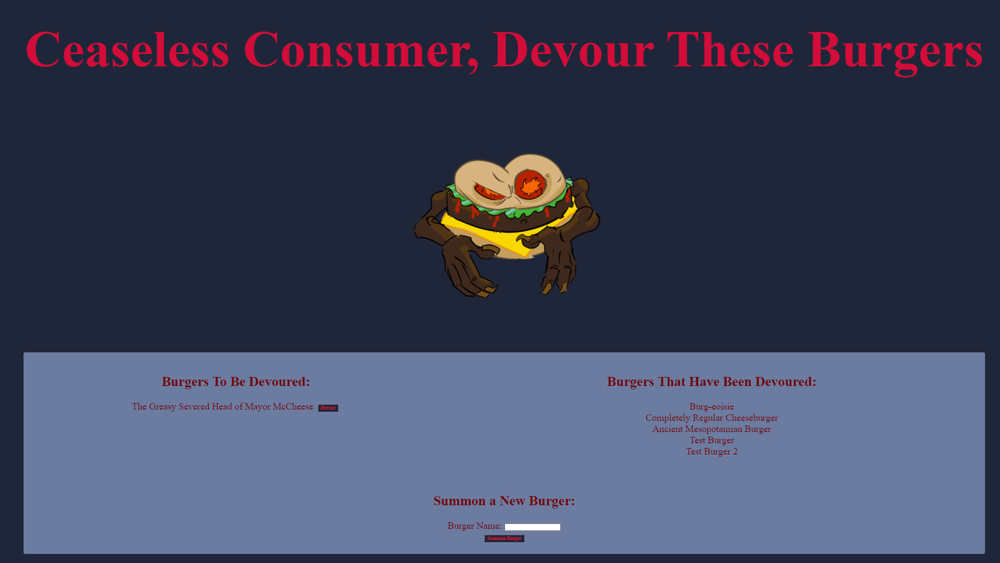

# Devouring Burgers App

## Table of Contents

1. [Description](#description)
2. [Installation](#installation)
3. [Usage](#usage)
4. [License](#license)
5. [Screenshot](#screenshot)

## Description:
Completed as a homework assignment for Trilogy's Fullstack Web Development Program through Washington University. The purpurpose of the application was to deploy an application through Heroku that was able to manipulate a table in MySQL while following MVC design pattern.

The application allows a user to add burgers of a desired name to a list, devour them by pressing a button, and moving the devoured burger into a separate list.

## Usage:
[Click here](https://burgerloggerzl.herokuapp.com//) to access the application deployed on Heroku

## License: 
MIT

## Contributing: 
[Myrmoxenus](https://github.com/Myrmoxenus)

## Screenshot: 

